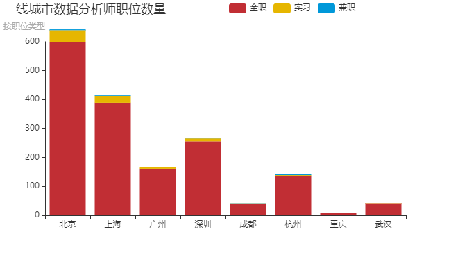
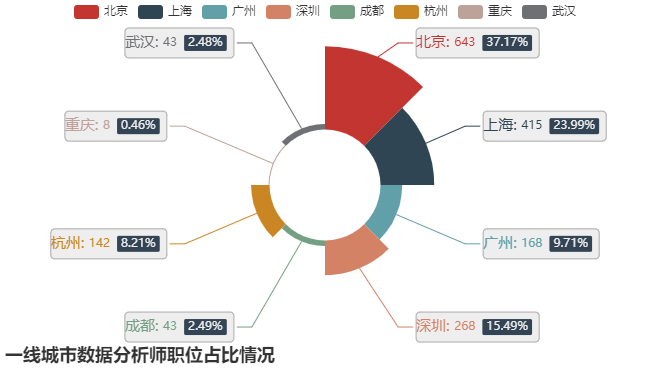
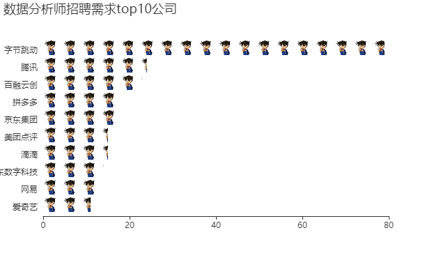
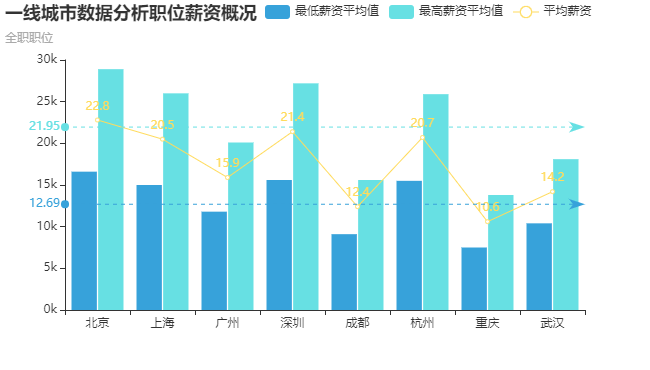
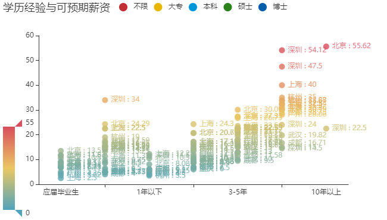
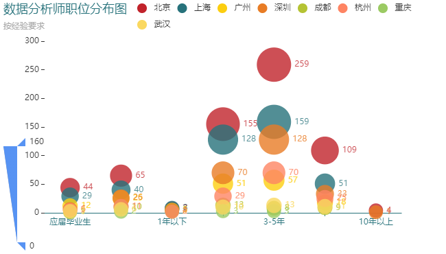
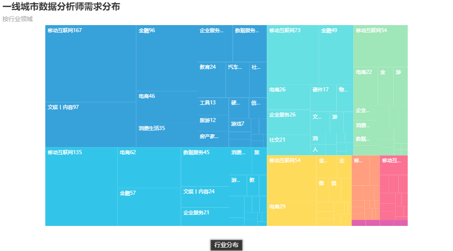
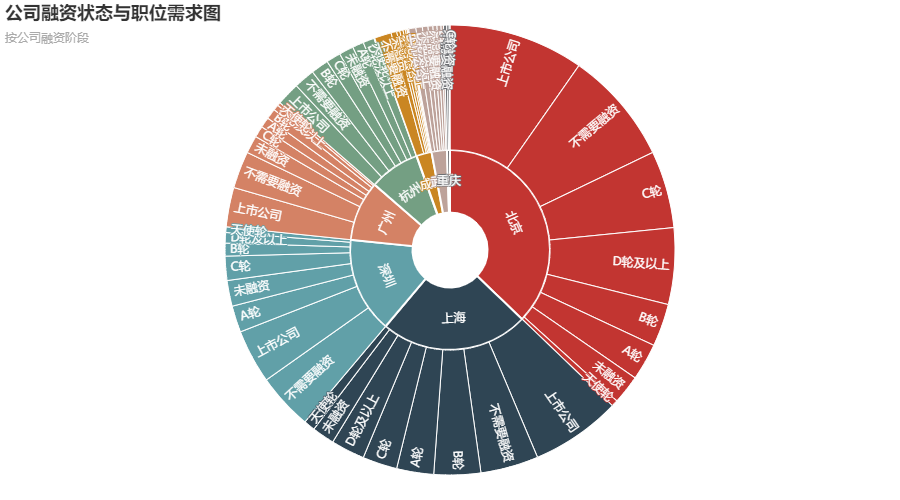
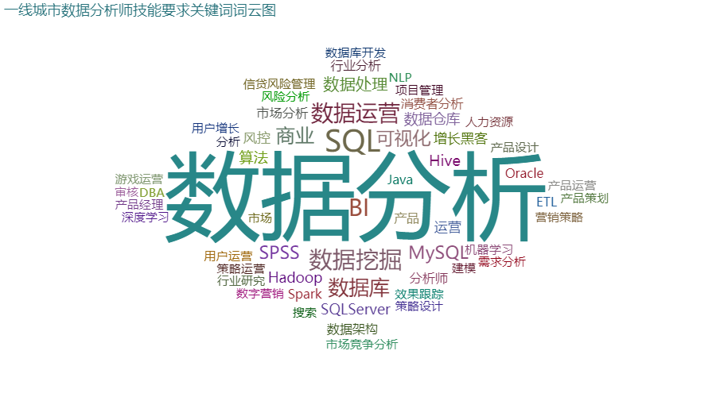

# DataAnalysis_position_-visualization
一线城市+新一线城市（成杭重武）数据分析师职位数据可视化

## 概述
* 简述：分析下当前一线（北上广深）和新一线（成杭重武）城市发布的数据分析师职位行情
* 数据来源：拉勾
* 数据获取方式：爬虫 Python request和BeautifulSoup
* 数据获取日期： 2019年7月10日
* 初始数据shape：(1829,24)
* 分析内容：
    - 维度1：城市
        1. 各个城市发布的职位数量比较
        2. 各个城市发布的职位薪资概况
        3. 各个城市发布的职位对于经验要求
        4. 各个城市发布的职位要求关键词
        5. 各个城市发布的职位的行业分布
        6. 各个城市简历处理情况
    - 维度2：公司
        1. 各个公司发布的招聘数量
        2. 各个融资阶段的公司的对数据分析师的需求量
        3. 各个行业公司对数据分析师需求量（1.5中已完成）
    - 维度3：人
        1. 不同学历（经验）的求职者可以预期的薪资(月薪)
## 可视化结果

#### 数据分析师职位需求程度

####数据分析师职位需求top10公司

#### 数据分析师职位薪资概况

####数据分析师职位经验要求

从上图可以看出：
- 各个城市更偏好于招聘具有3-5年经验要求的数据分析师，而经验1年以下的需求是非常少的，虽然也有相当一部分招聘需求不限经验，但是还是建议若想从事数据分析职位请最好具备1年以上经验之后再考虑求职
- 需要10年以上工作经验的数据分析师只有北京、深圳（互联网大厂）
####数据分析师职位需求行业

* 对于数据分析师职位的需求，主要还是来自于互联网行业
* 另外两大行业领域是金融和电商，北京、深圳和上海金融业十分，杭州电商行业
####公司融资阶段与需求关系

* 上市公司或者不需要融资的公司对于数据分析师职位的需求名列前茅，大平台、完善的体系、多元化业务，更重要的是财大气粗
#### 数据分析师职位技能要求关键词词云图

职位技能关键词：
- "数据分析"毋庸置疑，与其说是技能，不如说其是一个思维能力、经验
- "数据库、SQL、MySQL"，要想做数据分析，首先得会获取数据，所谓巧妇难为无米之炊，没有数据就没有下文了，所以想成为数据分析师懂得数据库基本知识，会DDL、DML是必须的，作为同样的RDBMS，要求掌握Oracle的公司要求掌握MySQL要少的多，这应该是得益于MySQL的免费开源以及日渐完善的功能受到很多公司欢迎；掌握Hive、Hadoop、Spark等，可以作为加分项或者说成为技术向数据分析师需要掌握的更高阶的技能
- "SPSS"作为一个优秀的统计分析工具，也被很多公司列为基本技能项之一
- "商业、BI、可视化"，商业智能，制作报表、dashboard，商业分析报告是商业数据分析师或者说业务数据分析师的重点产出，具备分析、写、画能力的同时，如果具备讲的能力将会在商业分析师的应聘中如虎添翼
- "数据挖掘"这一关键词，对技术方面的要求更高

